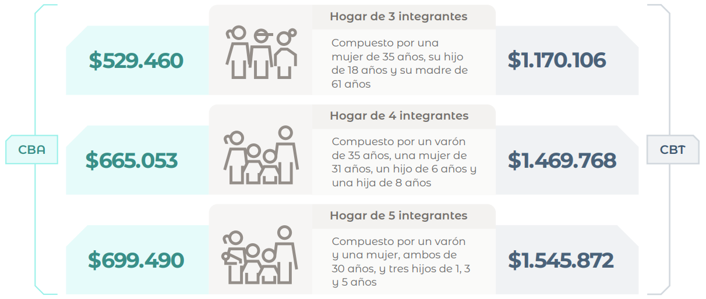
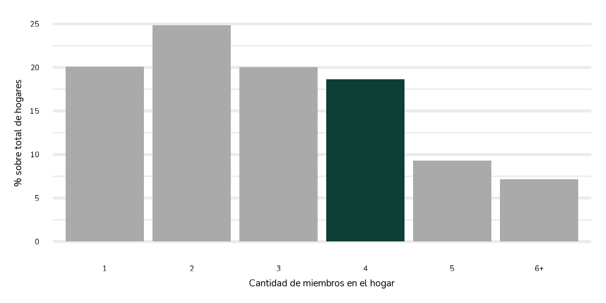
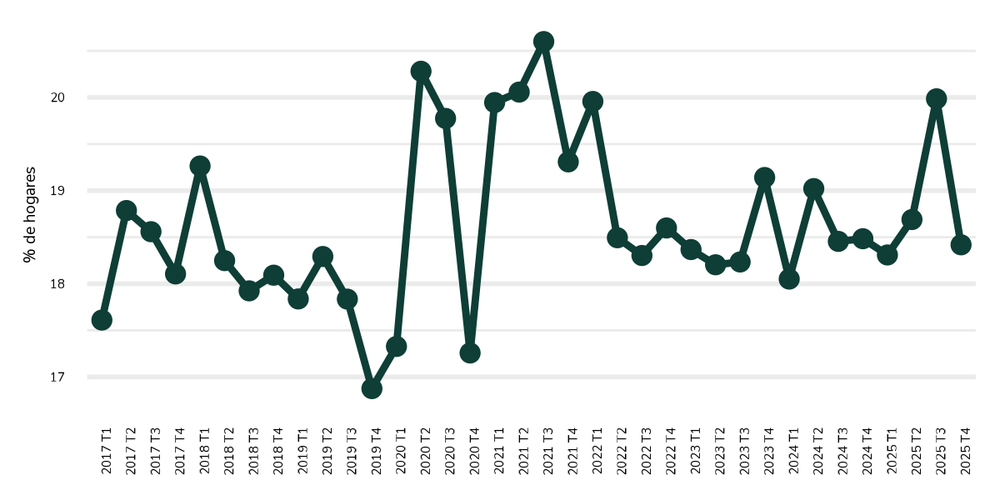
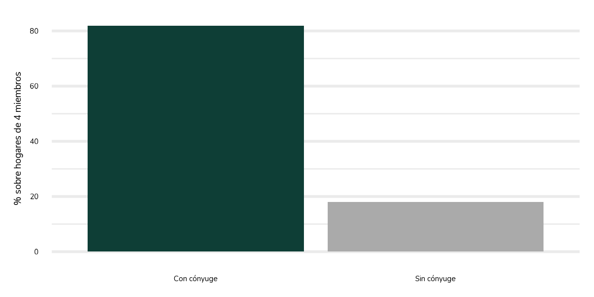
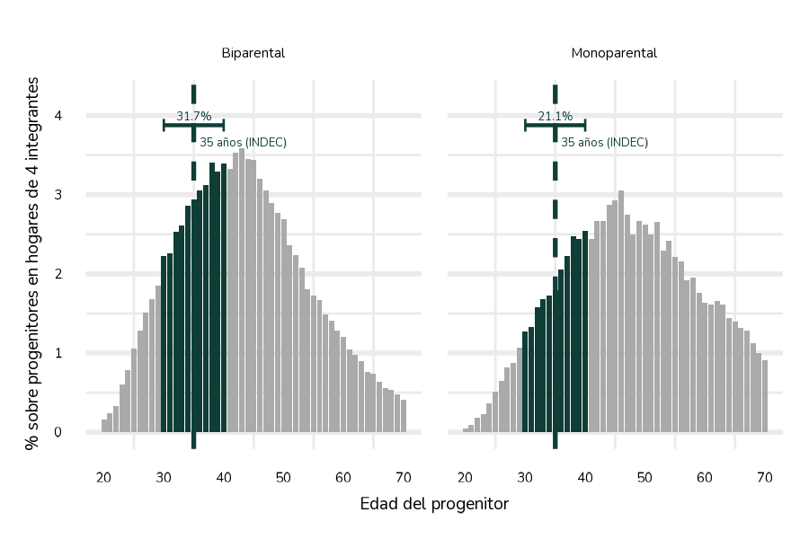
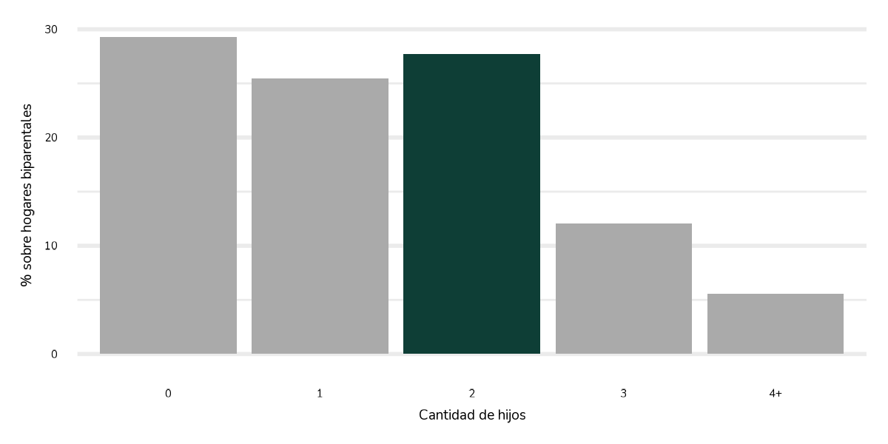
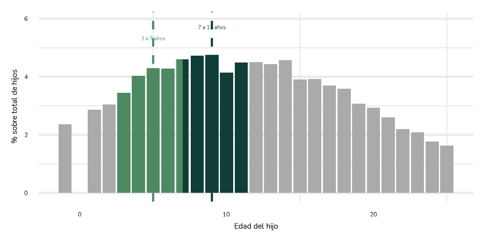
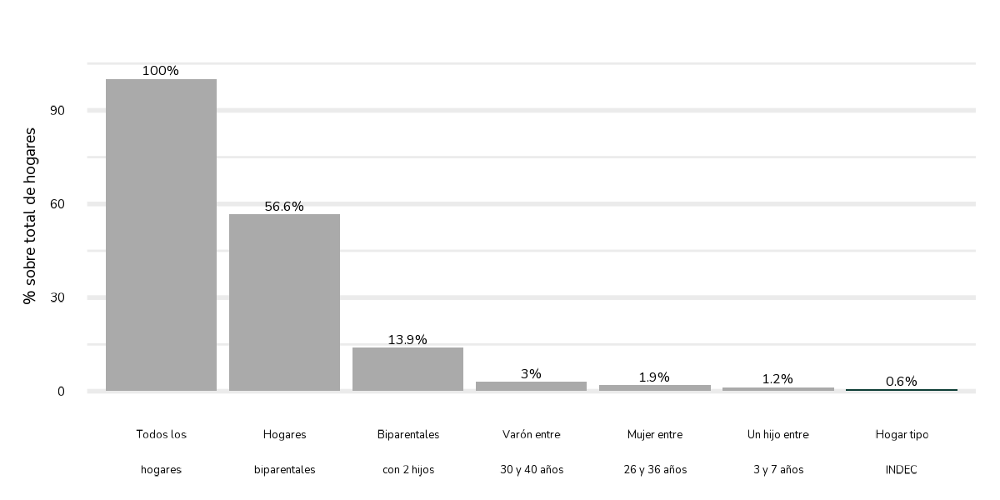
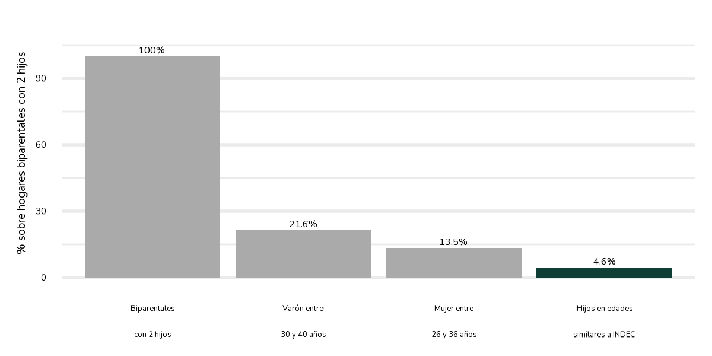

```{=html}
<article class="report">
<div id="scroll-progress"></div>
  <div class="report-container">
<header class="report-header">
  <p class="report-kicker">Estadística · Sociedad · Consumo</p>
  <h1>¿Cuán representativa es la <br> familia tipo del INDEC?</h1>
  <p class="report-date">Mayo 2026</p>
</header>
<section class="report-body">
  <p style="text-align: justify;">

No se si les sucede lo mismo a ustedes, a menudo me hallo en piloto automático rodeado de información, reduciendo los espacios de escucha activa a momentos en los que ciertamente lo estoy decidiendo. No obstante, existen momentos en los cuales, dentro de mi piloto automático, escucho una frase, un número, o quizá una pequeña inflexión en el tono de una de las sílabas de una palabra y toda la información que hasta el momento era ruido, se convierte en información como acivo. En ese momento, es como si hubiese prestado atención a cada palabra que escuche y se me generan un montón de ideas.
  </p>
  
  <p style="text-align: justify;">
Esto me sucedeió la semana pasada, en un programa radial de una importante emisora. Había salido el dato de inflación de la Ciudad de Buenos Aires (CABA) y el periodista lo estaba comentando. En verdad, se escuchaba algo como lo siguiente: "la inflación de la ciudad de Buenos Aires trepó al 2,6%, significando que (...) con los rubros transporte, comunicación y cuidado personal como mayores (...) Así, un hogar tipo, con dos adultos de 35 años de edad junto con dos hijos de 9 y 6 años necesitó $ 1.500.000 para no ser considerado pobre y $ 800.000 a su vez para no ser considerado indigente" (cifras aproximadas). En el momento en que escuché la "hogar tipo", todo lo que comentó en la columna se me hizo presente.
 </p>
 
  <p style="text-align: justify;">
Si bien la pregunta nace debido al espacio geográfico de CABA, decidí llevar este razonamiento a nivel nacional. Por tal motivo, adjunto a continuación como se componen los hogares tipos a nivel nacional al momento de construir canastas de consumo y, en consecuencia, determinar cuánto necesita un hogar para ser considerado pobre/indigente.
  </p>
  
  <h3 class="figure-title">
    Figura 1. Canasta Básica Total (CBT) y Alimentaria (CBA) de tres hogares tipo a nivel nacional
  </h3>
  <div id="canastas-indec" class="report-figure">
```


```{r, echo=FALSE, out.width="70%"}

```


```{=html}
 </div>
  <p style="font-size: 0.85rem; color: #666; margin-top: -0.1rem;">
    Fuente: Fuente: INDEC (abril de 2026).
  </p>
  
<p style="text-align: justify;">
  A partir de visualizar estas composiciones, y entendiendo además ciertos rasgos del presente —la creciente priorización de la carrera profesional, la postergación de la maternidad y la paternidad, el deterioro de los vínculos interpersonales presenciales y, como consecuencia de todo ello, la caída sostenida de la natalidad—, la pregunta se me hizo muy evidente. Ese hogar que aparece de manera recurrente en informes oficiales, titulares periodísticos y debates televisivos, ¿existe realmente en la Argentina actual? ¿Cuántos hogares argentinos se parecen, aunque sea parcialmente, a esa descripción? En otras palabras, ¿cuán “tipo” es verdaderamente una familia tipo?
</p>

<p style="text-align: justify;">
  Esa, en rigor, es la pregunta que intentamos responder a continuación.
</p>
```


```{=html}

  <p style="text-align: justify;">
  Me hice esa pregunta mirando datos de la Encuesta Permanente de Hogares, y lo que encontré me resultó más elocuente que cualquier nota de tapa: una familia tipo representa menos del 1% de los hogares a nivel nacional.
  </p>
```

```{=html}
<h3 class="figure-title">
  Figura 1. Distribución de hogares biparentales según cantidad de hijos y distribución de hijos según edad del hijo.
</h3>
<div class="report-figure figure-row">
  
  
</div>
<p style="font-size: 0.85rem; color: #666; margin-top: -0.1rem;">
  Fuente: elaboración propia en base a EPH-INDEC.
</p>
```

```{=html}
  <p style="text-align: justify;">
  Empecemos por el principio. La familia tipo supone, antes que nada, que hay dos adultos en el hogar. Eso ya deja afuera a casi la mitad del país: según los datos de la EPH, apenas el <strong>56,6% de los hogares son biparentales</strong>. El resto —hogares unipersonales, monoparentales, convivencias sin pareja— queda fuera desde la primera condición. Y entre los hogares biparentales, la distribución por cantidad de hijos es más pareja de lo que uno imaginaría: casi el 30% no tiene hijos, el 25% tiene uno, cerca del 28% tiene dos —que es el valor de la familia tipo— y el resto tiene tres o más.
  </p>
  <p style="text-align: justify;">
  La edad de los hijos tampoco concentra el peso donde uno esperaría. El pico de representación está entre los 8 y los 12 años —justo donde la familia tipo los ubica—, pero la distribución es bastante plana entre los 5 y los 17 años. Los hijos en edad escolar no son una rareza, pero tampoco dominan de manera abrumadora el panorama.
  </p>

  <h3 class="figure-title">
    Figura 2. El embudo hacia la familia tipo: participación en el total de hogares según criterios acumulados.
  </h3>
  <div class="report-figure">
```

```{r, echo=FALSE, message=FALSE, fig.width=10, fig.height=5}
# g3: embudo de filtros desde todos los hogares hasta hogar tipo INDEC


```

```{=html}
  </div>
  <p style="font-size: 0.85rem; color: #666; margin-top: -0.1rem;">
    Fuente: elaboración propia en base a EPH-INDEC.
  </p>

  <p style="text-align: justify;">
  El gráfico anterior lo muestra con claridad. Cada condición que agrega la metodología —biparental, con dos hijos, con edades de los progenitores en cierto rango, con hijos en edad escolar— recorta el universo de manera significativa. El resultado final es casi conmovedor en su especificidad: solo el <strong>0,6% de todos los hogares argentinos</strong> cumple con todas las condiciones que define la metodología. Dicho de otro modo: el hogar de referencia con el que medimos el bienestar de los argentinos coincide exactamente con menos de uno de cada ciento cincuenta hogares reales.
  </p>

  <h3 class="figure-title">
    Figura 3. Perfil de los hogares biparentales con 2 hijos: participación según criterios adicionales.
  </h3>
  <div class="report-figure">
```

```{r, echo=FALSE, message=FALSE, fig.width=10, fig.height=5}
# g4: filtros dentro de biparentales con 2 hijos

```

```{=html}
  </div>
  <p style="font-size: 0.85rem; color: #666; margin-top: -0.1rem;">
    Fuente: elaboración propia en base a EPH-INDEC.
  </p>

  <p style="text-align: justify;">
  Incluso si tomamos solo el subconjunto de hogares biparentales con dos hijos —que ya representa apenas el 13,9% del total—, la restricción de las edades de los progenitores deja al 21,6% con un varón entre 30 y 40 años y al 13,5% con una mujer entre 26 y 36 años. Sumar además la condición de que los hijos estén en edades similares a las del modelo INDEC lleva ese número al <strong>4,6%</strong>. La especificidad del modelo no es un defecto metodológico; es una elección. Pero conviene saber cuántos hogares reales representa.
  </p>

  <h3 class="figure-title">
    Figura 4. Distribución de hogares según cantidad de miembros y participación de hogares de 4 miembros en el tiempo.
  </h3>
  <div class="report-figure">
```

```{r, echo=FALSE, message=FALSE, fig.width=12, fig.height=5}
# g5: distribución por cantidad de miembros
# g6: serie temporal de hogares de 4 miembros


```

```{=html}
  </div>
  <p style="font-size: 0.85rem; color: #666; margin-top: -0.1rem;">
    Fuente: elaboración propia en base a EPH-INDEC.
  </p>

  <p style="text-align: justify;">
  Los hogares de cuatro miembros representan alrededor del <strong>18-19% del total</strong>, con una variación trimestral estable a lo largo de los últimos años —con algunos picos en 2020 y 2021 asociados a los cambios en la convivencia durante la pandemia—. Eso significa que la estructura de cuatro integrantes es una entre varias opciones posibles: hay casi tantos hogares de dos personas como de cuatro, y los unipersonales no se quedan muy atrás.
  </p>

  <h3 class="figure-title">
    Figura 5. Presencia de cónyuge en hogares de 4 miembros y distribución por edad del progenitor según tipo de hogar.
  </h3>
  <div class="report-figure">
```

```{r, echo=FALSE, message=FALSE, fig.width=12, fig.height=5}
# g7: con/sin cónyuge en hogares de 4 miembros
# g8: distribución de edad del progenitor por tipo de hogar


```

```{=html}
  </div>
  <p style="font-size: 0.85rem; color: #666; margin-top: -0.1rem;">
    Fuente: elaboración propia en base a EPH-INDEC.
  </p>

  <p style="text-align: justify;">
  Entre los hogares de cuatro integrantes, la gran mayoría incluye una pareja: el 82% tiene cónyuge presente. La distribución etaria de los progenitores muestra que, en hogares biparentales, el <strong>31,7% de los progenitores tiene menos de 35 años</strong> —el umbral que usa el INDEC para el varón de referencia—. En hogares monoparentales del mismo tamaño, esa proporción cae al 21,1%.
  </p>
  <p style="text-align: justify;">
  
  Está claro que las medicioens promedio y niveles general buscan justamente representar una foto promedio de la situación. Sin embago, Por supuesto que 
  
  
  
  ¿Qué concluyo de todo esto? No creo que la familia tipo sea un invento malicioso ni una negligencia estadística. Tiene una lógica: sirve para comparar el poder adquisitivo a lo largo del tiempo con un patrón fijo. El problema no es el dato en sí; el problema es cómo lo usamos. Cuando un sindicato dice que "una familia tipo necesita tantos pesos para vivir", está usando una abstracción demográfica como si fuera la experiencia vivida de la mayoría. Y no lo es. La mayoría de los hogares argentinos son más pequeños, más heterogéneos, más solos de lo que ese modelo sugiere.
  </p>
  <p style="text-align: justify;">
  No digo que el INDEC deba publicar cuarenta canastas distintas. Digo que cuando periodistas, políticos y analistas citan "la familia tipo" deberían aclarar que están hablando de un artefacto metodológico que describe a menos de uno de cada ciento cincuenta hogares. No porque sea un dato falso, sino porque la distancia entre el modelo y la realidad es parte de la información.
  </p>

</section>
  </div>
</article>
```

```{=html}
<script>

window.addEventListener("scroll", () => {

  const progressBar =
    document.getElementById("scroll-progress");

  if (!progressBar) return;

  const scrollTop =
    document.documentElement.scrollTop;

  const scrollHeight =
    document.documentElement.scrollHeight -
    document.documentElement.clientHeight;

  const scrollPercent =
    (scrollTop / scrollHeight) * 100;

  progressBar.style.height =
    scrollPercent + "%";

});

</script>
```
